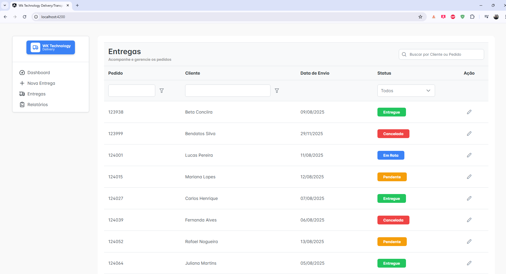
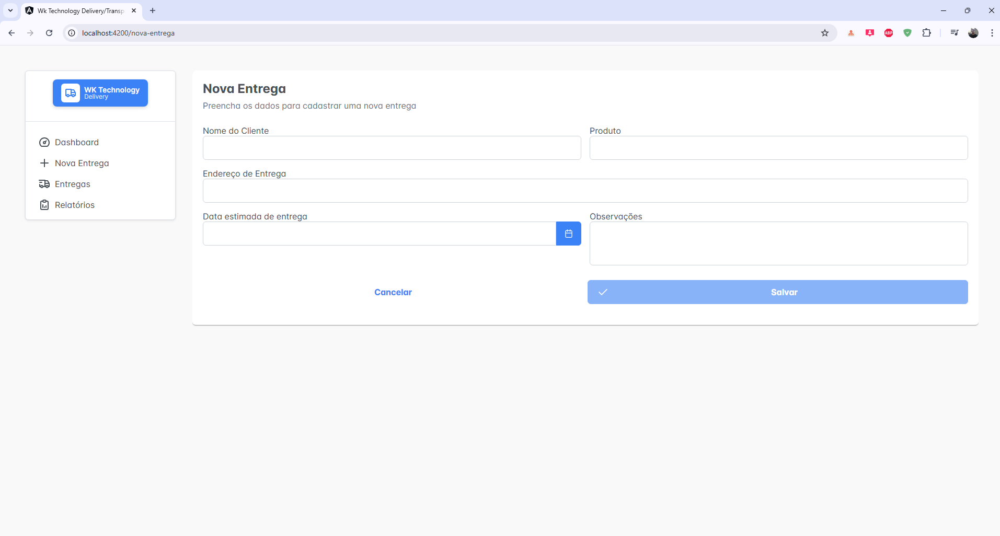
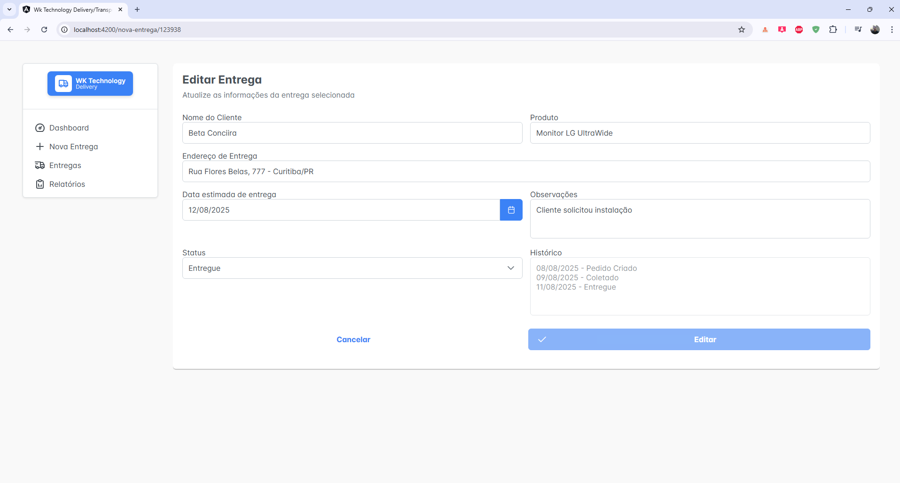
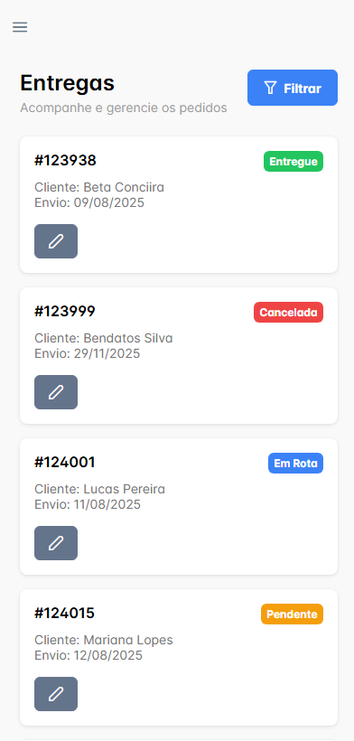
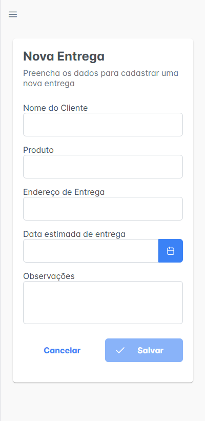
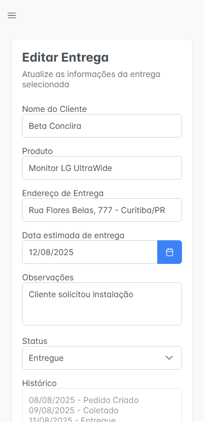

```markdown
# 📦 WK Technology Delivery – Projeto Teste

Projeto teste de um **sistema de gerenciamento de entregas (delivery/transporte)**.

O objetivo principal é demonstrar:
- Estruturação de um projeto Angular
- Uso do PrimeNG para construção de interfaces
- Padronização visual e organização de layout
- Clareza na evolução do projeto (commits, estrutura e decisões técnicas)

## 🚚 Visão Geral

O sistema simula um **painel administrativo de entregas**, permitindo:
- Listar entregas com filtros e paginação
- Acompanhar status das entregas
- Estrutura preparada para CRUD

## 🖥️ Tecnologias Utilizadas

- **Angular**
- **PrimeNG** – Componentes UI
- **Tabler Icons** – Ícones
- **TypeScript**
- **Json Server**
- **HTML5 / CSS3**

## 🎨 Interface e UX

O layout foi pensado seguindo padrões modernos de dashboards administrativos:

- Sidebar fixa com navegação
- Tabelas com status visual
- Estrutura compatível com componentes PrimeNG
- Design preparado para escalabilidade

O protótipo visual foi desenvolvido com base em um **design system simples**, priorizando legibilidade e clareza.

## 🧱 Estrutura Inicial do Projeto

```-

src/
 ├── app/
 │   ├── components/
 │   │   └── menu/
 │   ├── core/
 │   │   └── services/
 │   ├── pages/
 │   │   ├── dashboard/
 │   │   ├── delivery/
 │   └── shared/
 │       ├── modules/
 │       └── interfaces/
 └── assets/
```

## 🛠️ Instalação e execução do projeto

Ao baixar o projeto do github, deve rodar o comando **npm install** no terminal para instalar todos os third party packages (pacotes de dependência).

Para rodar o projeto deve utilizar o comando **ng s -o**.

## 🖥️ Visualização Desktop

Tela de Dashboard (Lista de Entregas)


Tela para criar Nova Entrega


Tela de Visualização e Edição da Entrega


## 📱 Visualização Mobile





## 📋 Lista de funcionalidades
- Criar uma Nova Entrega;
- Visualizar/Editar uma Entrega existente;
- Acréscimo de Loading para carregar os dados vindo da API;
- Responsividade para melhoria da experiência de usabilidade e visual dos usuários;
- Não foi adicionado a função de exclusão pelo fato que uma vez que criou uma Nova Entrega, eu penso que isso causaria uma má experiência ao usuário ao ver que seu produto que estava **Pendente** sumiu repentinamente, e acredito que por este motivo tem o histórico para indicar as etapas dos status e a data como forma de auditoria.

## ✨ Extras / Diferenciais

- Inicialmente foi utilizado o **json-server** para simular dados vindo de uma api;
- E no final utilizei o **supabase (backend)** para armazenar, gerar api e disponibilizar para consumir no frontend e realizar o **CRUD**, também subi o projeto nas nuvens na hospedagem gratuita através do **netlify (frontend)**;
- Houve a necessidade de criar o Lazy loading das telas de Listagem e Cadastro de Entregas/Deliveries para reduzir o budget ao gerar a build;
- Foi gerada a responsividade aprimorada pensada com base em UI/UX principalmente para dispositivos menores onde possui um tamanho compacto de tela.
